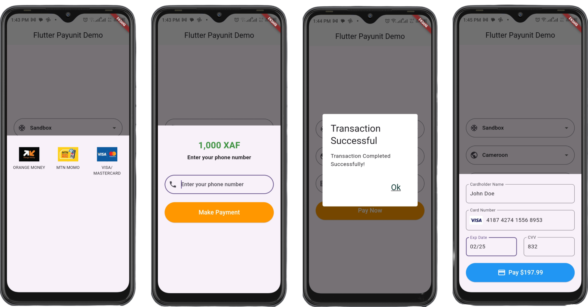

# PayUnit Android Library

The **PayUnit Android Library** provides a customizable button for processing payments in Android applications. This library simplifies the integration of payment processing features into your app.

## Table of Contents

- [Installation](#installation)
- [Usage](#usage)
    - [XML Usage](#xml-usage)
    - [Java Usage](#java-usage)
    - [Kotlin Usage](#kotlin-usage)
- [Gallery](#gallery)
- [License](#license)

## Installation

To use the PayUnit library in your Android project, follow these steps:

1. **Add Internet permission to your `AndroidManifest.xml` file:**

   **AndroidManifest**
   ```xml
   <?xml version="1.0" encoding="utf-8"?>
        <manifest xmlns:android="http://schemas.android.com/apk/res/android"
        xmlns:tools="http://schemas.android.com/tools">
   
        <uses-permission android:name="android.permission.INTERNET"/>
   
    </manifest>
    ```

2. **Add JitPack to your project-level `build.gradle` file:**
    
    **Groovy**

   ```groovy
   allprojects {
       repositories {
           google()
           mavenCentral()
           maven { url 'https://jitpack.io' }
       }
   }
   ```
   **Kotlin**

   ```kotlin
   allprojects {
       repositories {
           google()
           mavenCentral()
           maven ("https://jitpack.io")
       }
   }
   ```

3. **Add the dependency to your app-level `build.gradle` file:**

   **Groovy**

   ```groovy
   dependencies {
       implementation 'com.github.Bryandche:payunit-android:0.0.10'
   }
   ```
   **Kotlin**

   ```kotlin
   dependencies {
       implementation("com.github.Bryandche:payunit-android:0.0.10")
   }
   ```

## Usage

### XML Usage

To use the `PayUnitButton` in your XML layout, add the following code:

```xml
   <com.github.payunit.PayUnitButton
    android:id="@+id/payUnitButton"
    android:layout_width="match_parent"
    android:layout_height="wrap_content"/>
```

### Java Usage

To use the `PayUnitButton` in your Java code, follow these steps:

1. **Import and Initialize the button in your activity:**

   ```java
   import android.os.Bundle;
   import androidx.appcompat.app.AppCompatActivity;
   import com.github.payunit.PayUnitButton; // Import the PayUnitButton

   public class MainActivity extends AppCompatActivity {

       @Override
       protected void onCreate(Bundle savedInstanceState) {
           super.onCreate(savedInstanceState);
           setContentView(R.layout.activity_main);

           // Initialize the PayUnitButton
            PayUnitButton payUnitButton = findViewById(R.id.payUnitButton);

            // Configure the PayUnitButton
            payUnitButton.apiUsername("your_api_username");
            payUnitButton.apiPassword("your_api_password");
            payUnitButton.apiKey("your_api_key");
            payUnitButton.mode("live"); // "live" or "sandbox"
            payUnitButton.paymentCountry("CM"); // Example: Cameroon
            payUnitButton.totalAmount(1000); // Amount in Integer
            payUnitButton.currency("XAF"); // Currency code
            payUnitButton.returnUrl("your_return_url");
            payUnitButton.notifyUrl("your_notification_url");
   
             // Set a payment callback
            payUnitButton.setPaymentCallback(new PayUnitButton.PaymentCallback() {
            @Override
            public void onComplete(String transactionId, String transactionStatus) {
                if(transactionStatus == "SUCCESS"){
                    // TODO: Handle successful transaction             
                }else if(transactionStatus == "FAILED"){
                    // TODO: Handle failed transaction             
                }
            }
            
        });
   
       }
   }
   ```

### Kotlin Usage

To use the `PayUnitButton` in your Kotlin code, follow these steps:

1. **Import and Initialize the button in your activity:**

   ```kotlin
   import android.os.Bundle
   import androidx.appcompat.app.AppCompatActivity
   import com.github.payunit.PayUnitButton // Import the PayUnitButton

   class MainActivity : AppCompatActivity() {

       override fun onCreate(savedInstanceState: Bundle?) {
           super.onCreate(savedInstanceState)
           setContentView(R.layout.activity_main)
   
            // Initialize the PayUnitButton
            val payUnitButton: PayUnitButton = findViewById(R.id.payUnitButton)

            // Configure the PayUnitButton
            payUnitButton.apiUsername = "your_api_username"
            payUnitButton.apiPassword = "your_api_password"
            payUnitButton.apiKey = "your_api_key"
            payButton.mode = "live" // "live" or "sandbox"
            payUnitButton.paymentCountry = "CM" // Example: Cameroon
            payButton.totalAmount = 1000 // Amount in integer
            payButton.currency = "XAF" // Currency code
            payButton.returnUrl = "your_return_url"
            payButton.notifyUrl = "your_notification_url"
            payButton.setPaymentCallback(object : PayUnitButton.PaymentCallback {
                override fun onComplete(transactionId: String, transactionStatus: String) {
                    if(transactionStatus == "SUCCESS"){
                       // TODO: Handle successful transaction             
                    }else if(transactionStatus == "FAILED"){
                       // TODO: Handle failed transaction             
                    }
                }
            })
       }
   }
   ```

## Gallery



## License

This project is licensed under the MIT License - see the [LICENSE](LICENSE) file for details.